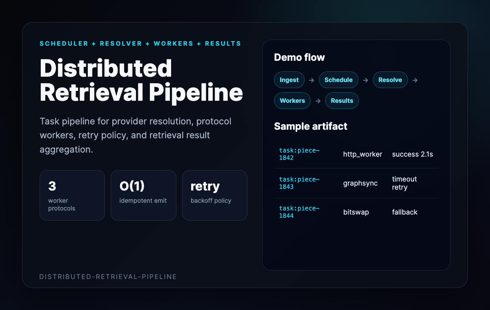
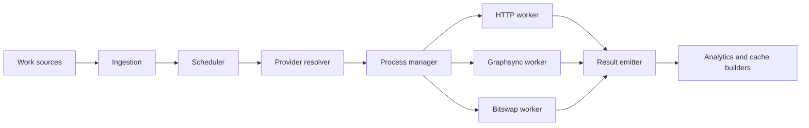
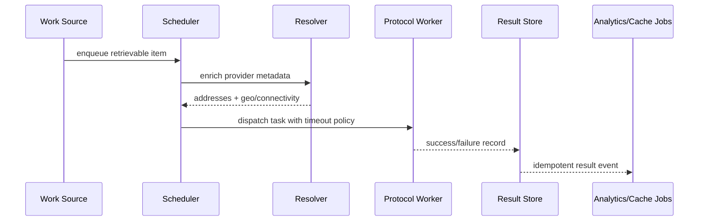
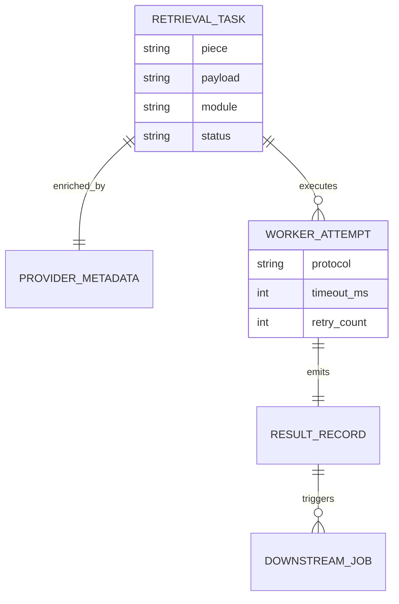

# Distributed Retrieval Pipeline Demo

This walkthrough presents the repo as distributed infrastructure for retrieval
task scheduling, execution, retries, and result aggregation.



## Flow Chart



## Sequence Diagram



## Task Entities



## Sample Result Record

```json
{
  "task_id": "piece-1842",
  "provider": "f01234",
  "protocol": "http",
  "success": true,
  "duration_ms": 2104,
  "bytes_read": 1048576,
  "retries": 0,
  "emitted_at": "2026-05-17T20:30:00Z"
}
```
